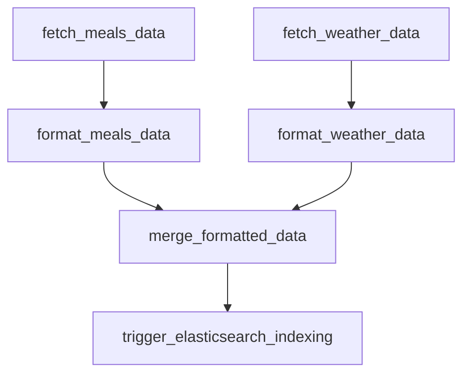

# NutriWeather Data Lake

A comprehensive data engineering project that combines weather data with meal recommendations using Apache Airflow, Apache Spark, Elasticsearch, and HDFS. This pipeline fetches real-time weather data and meal information, processes them through multiple stages, and provides intelligent meal recommendations based on current weather conditions.

## 🏗️ Architecture Overview

```
┌─────────────────┐    ┌─────────────────┐    ┌─────────────────┐
│   Data Sources  │    │   Processing    │    │    Storage &    │
│                 │    │    Pipeline     │    │  Visualization  │
├─────────────────┤    ├─────────────────┤    ├─────────────────┤
│ Open-Meteo API │────▶│ Apache Airflow  │────▶│ HDFS Cluster    │
│ TheMealDB API   │    │ Apache Spark    │    │ Elasticsearch   │
│ OSM Nominatim   │    │ PySpark         │    │ Kibana          │
└─────────────────┘    └─────────────────┘    │ Local Files     │
                                              └─────────────────┘
```

## 🛠️ Technology Stack

### Core Technologies
- **Apache Airflow 2.9.2** - Workflow orchestration and scheduling
- **Apache Spark 3.5.6** - Distributed data processing
- **PySpark** - Python API for Spark
- **Apache Hadoop HDFS 3.3.5** - Distributed file storage
- **Elasticsearch 8.15.0** - Search and analytics engine
- **Kibana 8.15.0** - Data visualization and exploration
- **Docker & Docker Compose** - Containerization and orchestration

### Development & Runtime
- **Astronomer Runtime 3.0-2** - Airflow distribution
- **Python 3.11+** - Primary programming language
- **OpenJDK 17** - Java runtime for Spark and Hadoop
- **Bitnami Spark Images** - Pre-configured Spark containers
- **Apache Hadoop Official Images** - HDFS cluster components

### Data Processing Libraries
- **pandas 1.5.0+** - Data manipulation and analysis
- **pyarrow 10.0.0+** - Columnar data format support
- **numpy 1.26.0+** - Numerical computing
- **requests 2.31.0+ (< 2.33.0)** - HTTP client library (version-pinned for urllib3 compatibility)
- **urllib3 1.26.0+ (< 2.3.0)** - HTTP library (compatible with requests)
- **hdfs 2.7.0** - Python HDFS client for distributed file operations

### API Integration
- **openmeteo-requests 1.1.0+** - Weather API client
- **requests-cache 1.1.0+** - HTTP request caching
- **retry-requests 2.0.0+** - Request retry mechanism

## 🌐 External APIs

### 1. Open-Meteo Weather API
- **Endpoint**: `https://api.open-meteo.com/v1/forecast`
- **Purpose**: Real-time weather data collection
- **Data Retrieved**:
  - Current temperature, humidity, wind speed
  - Hourly temperature forecasts
  - Daily UV index maximum
  - Location metadata (coordinates, timezone)
- **Rate Limits**: Free tier, no authentication required
- **Coverage**: Global weather data with high accuracy

### 2. TheMealDB API
- **Endpoint**: `https://www.themealdb.com/api/json/v1/1`
- **Purpose**: Comprehensive meal database access
- **Data Retrieved**:
  - Meal names, categories, and regions
  - Detailed cooking instructions
  - Ingredient lists with measurements
  - Meal thumbnails and metadata
- **Coverage**: 1000+ international recipes
- **Search Method**: Alphabetical iteration (a-z) for complete dataset

### 3. OpenStreetMap Nominatim
- **Endpoint**: `https://nominatim.openstreetmap.org/reverse`
- **Purpose**: Reverse geocoding for location names
- **Usage**: Convert coordinates to human-readable locations
- **Rate Limits**: 1 request per second (implemented with delays)

## 📊 Data Pipeline Flow

### Stage 1: Data Ingestion (Raw Layer)
```
fetch_meals_data() → /include/raw/meals/raw_meals_YYYYMMDD_HHMMSS.json
                  → HDFS: /nutriweather/raw/meals/
fetch_weather_data() → /include/raw/weather/raw_weather_YYYYMMDD_HHMMSS.json
                    → HDFS: /nutriweather/raw/weather/
```

**Raw Data Structures:**
- **Meals**: Complete TheMealDB API response with 50+ fields per meal
- **Weather**: Structured JSON with metadata, current, hourly, and daily sections
- **Retention**: All raw files preserved locally and in HDFS for reprocessing
- **HDFS Storage**: Distributed storage with 2x replication for fault tolerance

### Stage 2: Data Transformation (Formatted Layer)
```
format_meals.py → /include/formatted/meals/formatted_meals_YYYYMMDD_HHMMSS.parquet
              → HDFS: /nutriweather/formatted/meals/
format_weather.py → /include/formatted/weather/formatted_weather_YYYYMMDD_HHMMSS.json
                 → HDFS: /nutriweather/formatted/weather/
```

**Transformations Applied:**
- **Meals Processing**:
  - Ingredient consolidation (20 ingredient fields → single array)
  - Preparation time estimation algorithm
  - Instruction cleaning and formatting
  - Category and region standardization
  - Clean single-file Parquet output (no Spark artifacts)
  - **HDFS Integration**: Automatic backup to distributed storage
- **Weather Processing**:
  - Location name enrichment via reverse geocoding
  - Timestamp standardization (ISO 8601)
  - Data validation and type conversion
  - **HDFS Archival**: Long-term storage for historical analysis

**File Architecture:**
- **Local Output**: Single parquet files without `_SUCCESS` or partition artifacts
- **HDFS Mirror**: Distributed copies for high availability
- **Consistent Naming**: `formatted_meals_YYYYMMDD_HHMMSS.parquet` format
- **Cross-Platform Access**: Available via local filesystem and HDFS API

### Stage 3: Data Integration (Usage Layer)
```
merge_formatted.py → /include/usage/temperature_timeseries_YYYYMMDD_HHMMSS.jsonl
                  → /include/usage/enhanced_recommendations_YYYYMMDD_HHMMSS.jsonl
                  → HDFS: /nutriweather/usage/timeseries/
                  → HDFS: /nutriweather/usage/recommendations/
```

**Output Formats:**
1. **Temperature Time Series** (JSONL):
   ```json
   {
     "@timestamp": "2024-12-19 15:30:00",
     "temperature": 18.5,
     "location": "Paris, France",
     "latitude": 48.8534,
     "longitude": 2.3488
   }
   ```

2. **Enhanced Recommendations** (JSONL):
   ```json
   {
     "@timestamp": "2024-12-19 15:30:00",
     "current_temperature": 18.5,
     "temperature_category": "moderate",
     "suggested_meal": "Beef Bourguignon",
     "preparation_time": "45 minutes",
     "recommended_advice": "Great weather for hearty meals!",
     "location": "Paris, France"
   }
   ```

### Stage 4: Data Indexing (Elasticsearch)
```
index_elasticsearch.py → Elasticsearch indices:
                       → nutriweather_temperature
                       → nutriweather_enhanced
                       → HDFS: /nutriweather/indexed/ (metadata)
```

## 🗂️ File Formats & Data Organization

### Directory Structure
```
Local Storage (/usr/local/airflow/include/):
├── raw/
│   ├── meals/           # JSON files from TheMealDB API
│   └── weather/         # JSON files from Open-Meteo API
├── formatted/
│   ├── meals/           # Parquet files (optimized for Spark)
│   └── weather/         # JSON files (enriched with location data)
├── usage/               # JSONL files (Elasticsearch-ready)
└── scripts/             # Python processing modules

HDFS Storage (/nutriweather/):
├── raw/
│   ├── meals/           # Archived raw meal data
│   └── weather/         # Archived raw weather data
├── formatted/
│   ├── meals/           # Processed parquet files
│   └── weather/         # Enhanced weather JSON files
├── usage/
│   ├── timeseries/      # Temperature time series data
│   └── recommendations/ # Enhanced meal recommendations
└── indexed/             # Elasticsearch indexing metadata
```

### HDFS Integration Benefits
- **Fault Tolerance**: 2x replication across DataNodes
- **Scalability**: Horizontal scaling for large datasets
- **Historical Storage**: Long-term archival of all pipeline outputs
- **Cross-Platform Access**: Available to Spark, Python, and external tools
- **Backup Strategy**: Automatic distributed backup for critical data

### File Naming Convention
- **Pattern**: `{type}_{category}_{YYYYMMDD_HHMMSS}.{extension}`
- **Example**: `formatted_meals_20241219_153045.parquet`
- **Benefits**: Chronological sorting, easy latest file identification

### Format Justifications
- **Raw → JSON**: Preserves original API response structure
- **Formatted Meals → Parquet**: Columnar format optimized for Spark operations
- **Formatted Weather → JSON**: Maintains nested structure for complex weather data
- **Usage → JSONL**: Elasticsearch bulk indexing compatibility

## 🚀 DAG Execution & Orchestration

### Primary DAG: `start_pipeline_dag`
**Trigger**: Manual execution or API call
**Schedule**: On-demand (no automatic scheduling)
**Max Active Runs**: 1 (prevents concurrent executions)

#### Task Dependencies


#### Task Details
1. **fetch_meals_data** (Python Task)
   - Runtime: ~2-3 minutes
   - Memory usage: ~200MB
   - Output: ~1000 meals in JSON format

2. **fetch_weather_data** (Bash → Python Script)
   - Runtime: ~10-15 seconds
   - API calls: 1 request to Open-Meteo
   - Output: Current + 24h forecast data

3. **format_meals_data** (Spark Job)
   - Runtime: ~30-45 seconds
   - Spark cluster: 1 master + 1 worker (2GB memory)
   - Operations: DataFrame transformations, UDF applications

4. **format_weather_data** (Python Script)
   - Runtime: ~5-10 seconds
   - External API: Nominatim reverse geocoding
   - Enhancement: Location name resolution

5. **merge_formatted_data** (Spark + Python)
   - Runtime: ~15-20 seconds
   - Logic: Weather-meal recommendation matching
   - Output: Two JSONL files for different use cases

6. **trigger_elasticsearch_indexing** (TriggerDAG)
   - Triggers: `index_elasticsearch_dag`
   - Wait for completion: True
   - Bulk indexing: Both temperature and enhanced datasets

### Secondary DAG: `index_elasticsearch_dag`
**Purpose**: Elasticsearch data indexing
**Trigger**: Called by primary DAG
**Features**: 
- Index creation with optimized mappings
- Bulk document indexing
- Error handling and retry logic

## 🐳 Docker Environment Setup

### Container Architecture
```yaml
Services:
├── Airflow Scheduler     # DAG scheduling and monitoring
├── Airflow Webserver     # Web UI (localhost:8080)
├── Airflow Worker        # Task execution
├── PostgreSQL           # Airflow metadata storage
├── Elasticsearch        # Search and analytics (localhost:9200)
├── Kibana              # Visualization dashboard (localhost:5601)
├── Spark Master        # Cluster coordination (localhost:8082)
├── Spark Worker        # Distributed computing (2GB memory)
├── HDFS NameNode       # HDFS metadata management (localhost:9870)
├── HDFS DataNode 1     # Distributed storage node 1
└── HDFS DataNode 2     # Distributed storage node 2
```

### Volume Mappings
- **Airflow**: `/usr/local/airflow/include` → Local `./include`
- **Spark**: `/opt/spark-apps` → Local `./apps`
- **Elasticsearch**: Persistent data volumes for index storage
- **HDFS NameNode**: `namenode-data` volume for metadata
- **HDFS DataNodes**: `datanode1-data`, `datanode2-data` volumes for block storage
- **HDFS Config**: `./hdfs_config` → Container `/opt/hadoop/etc/hadoop`

### Network Configuration
- **Internal Network**: `airflow` (Docker Compose network)
- **Service Discovery**: Container name-based DNS resolution
- **Port Exposure**: Web interfaces and APIs exposed to host
- **HDFS Access**: NameNode API (8020) and Web UI (9870) available externally

## 🔧 Development Setup

### Prerequisites
- Docker Desktop 4.0+
- Docker Compose V2
- 8GB+ available RAM
- 10GB+ free disk space

### Installation & Startup
```bash
# Clone repository
git clone <repository-url>
cd nutriweather-datalake

# Create HDFS configuration directory
mkdir -p hdfs_config scripts

# Start all services (including HDFS cluster)
docker-compose up -d

# Monitor logs (including HDFS services)
docker-compose logs -f

# Access services
# Airflow: http://localhost:8080 (admin/admin)
# Kibana: http://localhost:5601
# Spark UI: http://localhost:8082
# Elasticsearch: http://localhost:9200
# HDFS Web UI: http://localhost:9870
```

### Astro CLI Integration
```bash
# Install Astro CLI
curl -sSL install.astronomer.io | sudo bash

# Initialize Airflow project
astro dev init

# Start development environment
astro dev start

# Deploy to production
astro deploy
```

## 📈 Monitoring & Observability

### Airflow Monitoring
- **Web UI**: Task status, logs, execution history
- **Metrics**: Task duration, success rate, resource usage
- **Alerting**: Email notifications on failure (configurable)

### Spark Monitoring
- **Spark UI**: Job execution, stage details, executor status
- **Metrics**: Memory usage, task distribution, shuffle operations
- **Logs**: Driver and executor logs via Docker

### Elasticsearch Health
- **Cluster Health**: `GET /_cluster/health`
- **Index Statistics**: `GET /_stats`
- **Document Counts**: Real-time via Kibana dashboards

### HDFS Cluster Health
- **NameNode Web UI**: `http://localhost:9870` - Cluster overview, DataNode status
- **Filesystem Health**: `GET /webhdfs/v1/?op=GETFILESTATUS`
- **Block Reports**: DataNode health and storage utilization
- **Replication Status**: File replication factor and under-replicated blocks

## 🔧 HDFS Integration Examples

### Python HDFS Client Usage
```python
from hdfs import InsecureClient

# Connect to HDFS cluster
client = InsecureClient('http://namenode:9870', user='root')

# Write processed data to HDFS
with client.write('/nutriweather/formatted/meals/latest.parquet') as writer:
    # Write Parquet data from local processing

# Read historical data from HDFS
with client.read('/nutriweather/raw/weather/archive.json') as reader:
    historical_data = reader.read()

# List pipeline outputs
files = client.list('/nutriweather/usage/')

# Create directory structure
client.makedirs('/nutriweather/analytics/')
```

### Spark-HDFS Integration
```python
# Read from HDFS in Spark jobs
df = spark.read.parquet("hdfs://namenode:8020/nutriweather/formatted/meals/")

# Write Spark DataFrame to HDFS
df.write.mode("append").parquet("hdfs://namenode:8020/nutriweather/processed/")
```

## 🚨 Error Handling & Recovery

### Dependency Management
- **Version Compatibility**: Fixed urllib3/requests compatibility issues
- **Pinned Versions**: Critical dependencies pinned to prevent breaking changes
- **Container Isolation**: Dependencies managed within Docker containers

### Retry Mechanisms
- **Airflow Tasks**: 2 retries with 5-minute delays
- **API Requests**: Exponential backoff with retry-requests
- **Spark Jobs**: Automatic task retry on executor failure

### Data Validation
- **Schema Validation**: Spark DataFrame schema enforcement
- **Null Checks**: Required field validation before processing
- **API Response Validation**: HTTP status and content verification

### HDFS Fault Tolerance
- **DataNode Failure**: Automatic block replication to healthy nodes
- **NameNode Recovery**: Metadata checkpoint and journal recovery
- **Network Partitions**: Client retry with exponential backoff
- **Storage Full**: Automatic load balancing across DataNodes

### Monitoring Alerts
- **Failed Tasks**: Immediate notification via Airflow
- **Service Health**: Docker container health checks
- **Data Quality**: Custom validation rules in processing scripts
- **HDFS Health**: NameNode and DataNode availability monitoring

## 🎯 Use Cases & Applications

### Business Intelligence
- **Weather-Food Correlation Analysis**: Understand eating patterns vs. weather
- **Seasonal Menu Planning**: Restaurant menu optimization
- **Supply Chain**: Weather-based ingredient demand forecasting

### Personal Applications
- **Smart Meal Planning**: Automated meal suggestions based on weather
- **Health & Nutrition**: Weather-appropriate nutrition recommendations
- **Recipe Discovery**: Context-aware recipe recommendations

### Data Science Projects
- **Machine Learning**: Weather-food preference modeling
- **Predictive Analytics**: Meal demand forecasting
- **Time Series Analysis**: Weather pattern correlation with food choices

## 📝 Configuration Management

### Environment Variables
```yaml
# Airflow Configuration
AIRFLOW_UID: 50000
AIRFLOW_HOME: /usr/local/airflow

# Spark Configuration
SPARK_MASTER_URL: spark://spark-master:7077
SPARK_WORKER_MEMORY: 2G

# Elasticsearch Configuration
ELASTICSEARCH_HOSTS: http://es01:9200
```

### Connection Management
- **Spark Connection**: `spark://spark-master:7077`
- **Elasticsearch Connection**: `http://es01:9200`
- **External APIs**: No authentication required (free tiers)

## 🔮 Future Enhancements

### Planned Features
- **Machine Learning Integration**: Scikit-learn meal preference models
- **Real-time Streaming**: Apache Kafka for live weather updates
- **Geographic Expansion**: Multi-city weather and regional cuisine
- **Mobile API**: REST API for mobile application integration
- **HDFS Analytics**: Historical trend analysis on distributed data

### Scalability Improvements
- **Spark Cluster Expansion**: Multi-worker Spark setup
- **Elasticsearch Clustering**: Multi-node ES cluster
- **Airflow Scaling**: Kubernetes deployment with auto-scaling
- **Data Partitioning**: Date-based partitioning for large datasets
- **HDFS Scaling**: Additional DataNodes for increased storage capacity

...
